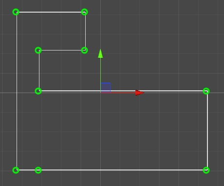

# Unity Polyline Editor
A simple editor for Unity to create a 2D polyline or polypath (list of 2D positions).

# Features:
- Works with Unity 2019.2, but should be good with older versions as well.
- Standard editing (shift to add, control to delete). 
- Undo and redo.
- Snapping and aligning points with neighbors.

# Usage
Simply add either the Polyline or Polypath component to a GameObject and begin editing.

The nodes list that the editor tool maintains can be accessed via `GetComponent<Polyline>().Nodes` at runtime.

Note: Polypath produces the exact same node list as Polyline. Its purpose is just to provide a slightly different editing experience in the editor. Polypath extends Polyline, so it is used the same way at runtime.

# Credits
This is a fork of [Unity3DPolylineEditor](https://github.com/Dandarawy/Unity3DPolylineEditor) by [Dandarawy](https://github.com/Dandarawy). Most of the code comes from there. Check it out!
